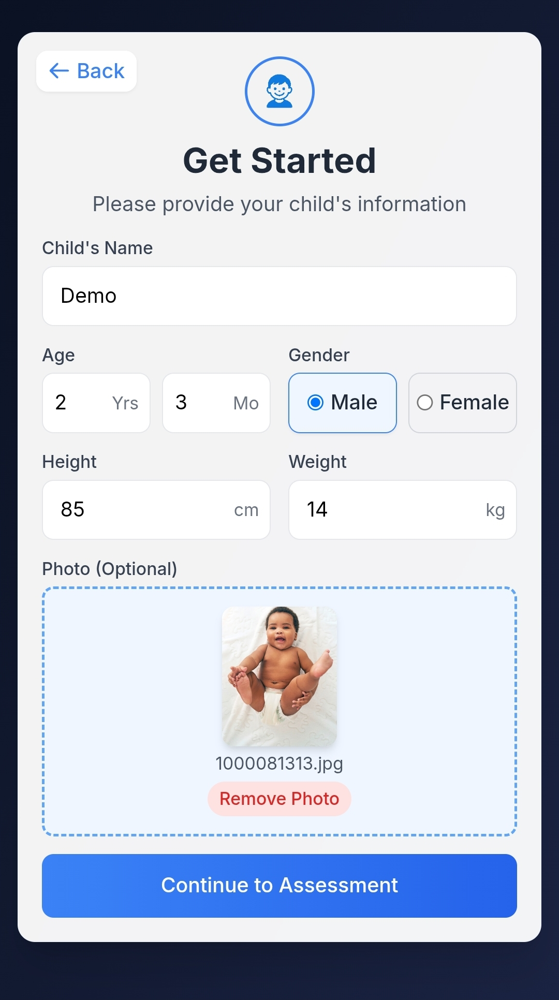
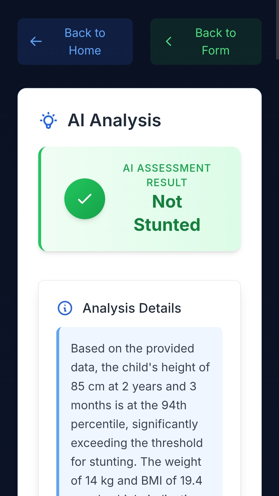

**APAC Solution Challenge May 2025**

Theme: [Healthcare]

Requirement: Using Gemini / Gemma

Team: Banana [BINUS International, Jakarta]

* William
* Kenny
* Tiffany
* Michael

# Project Overview

## Stunting AI

*Monitor and prevent child stunting with AI technology*

### Problem statement

Child stunting due to malnutrition leads to long-term physical and cognitive issues. Diagnosis is often delayed due to lack of accessible tools. Prevent the growth stunting of a baby due to malnutrition by scanning whether a baby is stunted or not.

### Solution summary

A fast-deploy, AI-assisted screening tool that helps caregivers or health workers input basic data and get an instant risk evaluation using Gemini/Gemma.

# Tech Stack

Web app.

* Frontend: **React + Vite**
* Styling: **Vanilla CSS**
* Linting: **ESLint**
* Deployment: **Vercel**
* AI: **Gemini API wrapper**

# Features / Functionality

* Easy navigation
* Phone compatibility

# Usage Instructions (Live)

1. Go to [https://stunting-ai.vercel.app/](https://stunting-ai.vercel.app/ "Go to website")
2. Click "Get Started"
3. Fill out the form
4. Click "Continue to Assessment" and get results

# Local setup

## Frontend Setup

```bash
git clone https://github.com/yourusername/stunting-ai.git
cd stunting-ai
npm install
```

Create a `.env` file in the root directory:

```
VITE_BACKEND_URL=http://localhost:3001
```

## Backend Setup (Secure API Proxy)

```bash
cd backend
npm install
```

Create a `backend/.env` file:

```
GEMINI_API_KEY=your_actual_gemini_api_key_here
PORT=3001
FRONTEND_URL=http://localhost:5173
```

## Running the Application

1. **Start the backend** (in one terminal):
```bash
cd backend
npm run dev
```

2. **Start the frontend** (in another terminal):
```bash
npm run dev
```

The app will be available at `http://localhost:5173` with the secure backend running on `http://localhost:3001`.

## 🔒 Security Best Practices

### API Key Security
- **Never hardcode API keys** in your source code
- Use environment variables with the `VITE_` prefix for client-side variables in Vite
- Keep your `.env` file in `.gitignore` to prevent accidental commits
- For production deployments, set environment variables in your hosting platform

### Environment Variables
- `VITE_GEMINI_API_KEY`: Your Google Gemini API key
- Environment variables prefixed with `VITE_` are exposed to the client-side code
- **Important**: Since this is a client-side application, the API key will be visible in the browser. For production applications, consider implementing a backend API to proxy requests and keep the API key secure on the server side.

### Deployment Security
- Set environment variables in your deployment platform (Vercel, Netlify, etc.)
- Never commit `.env` files to your repository
- Regularly rotate your API keys
- Monitor API usage for any suspicious activity

## ⚠️ Important Security Limitation

**Client-Side API Key Exposure**: This is a client-side React application, which means the Gemini API key will be visible to users in the browser's developer tools. This is a fundamental limitation of frontend applications.

### Recommended Production Security Measures:

1. **Implement API Rate Limiting**: Set up rate limiting on your Gemini API key to prevent abuse
2. **Monitor API Usage**: Regularly check your Google Cloud Console for unusual API usage patterns
3. **Consider Backend Proxy**: For production applications, implement a backend API that:
   - Stores the API key securely on the server
   - Proxies requests to the Gemini API
   - Implements authentication and rate limiting
   - Validates and sanitizes user inputs

### Alternative Architecture for Production:
```
Frontend (React) → Your Backend API → Gemini API
```
This way, the API key remains secure on your server and is never exposed to clients.

## 🚀 Simple Deployment

### Backend Deployment (Railway/Render/Heroku)

1. **Deploy backend** to any Node.js hosting service
2. **Set environment variables**:
   - `GEMINI_API_KEY=your_api_key`
   - `PORT=3001` (or service default)
   - `FRONTEND_URL=https://your-frontend-domain.com`

### Frontend Deployment (Vercel/Netlify)

1. **Deploy frontend** to static hosting
2. **Set environment variable**:
   - `VITE_BACKEND_URL=https://your-backend-domain.com`

### Quick Deploy Commands

**Backend (Railway example):**
```bash
cd backend
railway login
railway init
railway add
railway deploy
```

**Frontend (Vercel example):**
```bash
vercel --prod
```

# Demos
<table>
  <tr>
    <th>
      <source media="(prefers-color-scheme: dark)" srcset="documentation/Image1_HomeScreen.jpg">
      <source media="(prefers-color-scheme: light)" srcset="documentation/Image1_HomeScreen.jpg">
       
    </th>
    <th>
      <source media="(prefers-color-scheme: dark)" srcset="documentation/Image2_Form.jpg">
      <source media="(prefers-color-scheme: light)" srcset="documentation/Image2_Form.jpg">
       
    </th>
    <th>
      <source media="(prefers-color-scheme: dark)" srcset="documentation/Image3_Results.jpg">
      <source media="(prefers-color-scheme: light)" srcset="documentation/Image3_Results.jpg">
       
    </th>
  </tr>
</table>

# Limitations

* No database - it's all stateless
* Gemini output depends heavily on form quality
* Not a substitute for real medical evaluation

# Future Upgrades

* Add image-based height/weight input
* Save past assessments via login
* Link to medical databases / WHO child growth standards
* Multilingual support for broader reach

# License & Attribution

* MIT License
* AI via Gemini API
* Canva
### Picture references:
* Food picture - https://www.pregnancy.com.au/3-easy-baby-food-recipes-you-can-make-at-home/
* Taller and shorter person - https://cdn.prod.website-files.com/5ee7039040ea6efb80d7521c/5fd999586cf6d03d6bbc39e3_Of-Ages-and-Stages-1400x700.jpg
* Not stunted baby - https://www.thebump.com/a/baby-milestones
* Stunted baby - https://www.adelaidenow.com.au/lifestyle/health/generations-of-stunted-babies-tragedy-of-malnourished-children-in-syria-and-around-the-world/news-story/8f1ba403832f82ce42d0956a0c371644
### Video 
* Music - https://www.youtube.com/watch?v=xPgX4C05vG4&ab_channel=AudioLibrary%E2%80%94NoCopyrightBackgroundMusic

