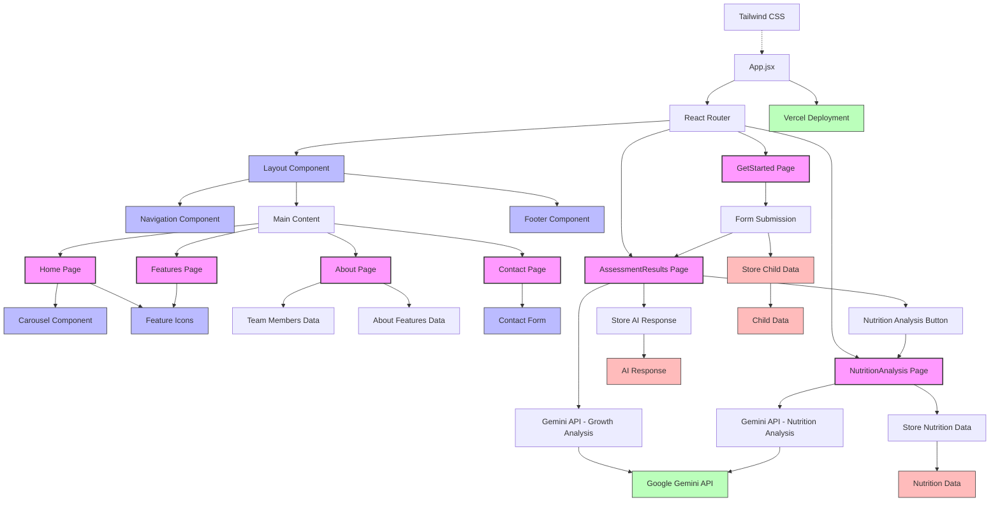
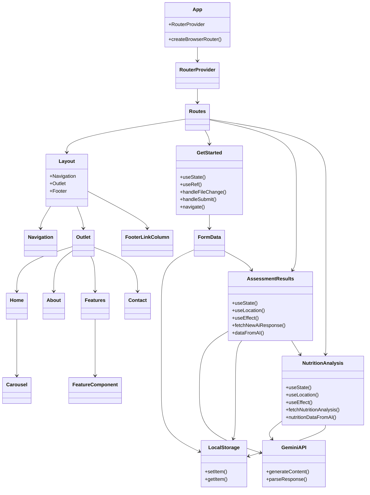
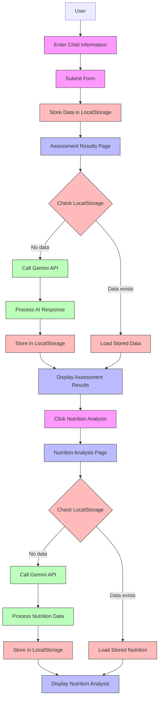
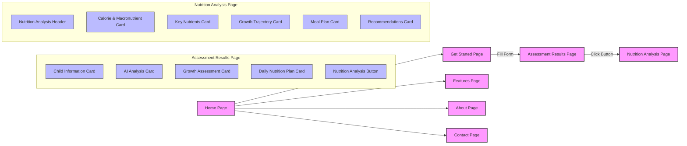
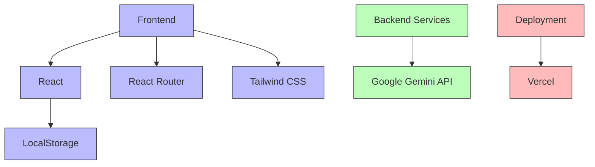

# StuntingAI Architecture Diagram

## Application Structure

```mermaid
graph TB
    %% Main Application Structure
    App[App.jsx] --> Router[React Router]

    %% Router Configuration
    Router --> Layout[Layout Component]
    Router --> GetStarted[GetStarted Page]
    Router --> AssessmentResults[AssessmentResults Page]
    Router --> NutritionAnalysis[NutritionAnalysis Page]

    %% Layout Structure
    Layout --> Navigation[Navigation Component]
    Layout --> MainContent[Main Content]
    Layout --> Footer[Footer Component]

    %% Main Content Routes
    MainContent --> Home[Home Page]
    MainContent --> About[About Page]
    MainContent --> Features[Features Page]
    MainContent --> Contact[Contact Page]

    %% Component Dependencies
    Home --> Carousel[Carousel Component]
    Home --> FeatureIcons[Feature Icons]

    Features --> FeatureIcons

    About --> TeamMembers[Team Members Data]
    About --> AboutFeatures[About Features Data]

    Contact --> ContactForm[Contact Form]

    %% Form Flow
    GetStarted --> FormSubmission[Form Submission]
    FormSubmission --> LocalStorage[Store Child Data]
    FormSubmission --> AssessmentResults

    %% Assessment Results Flow
    AssessmentResults --> GeminiAPI1[Gemini API - Growth Analysis]
    AssessmentResults --> StoreResults[Store AI Response]
    AssessmentResults --> NutritionButton[Nutrition Analysis Button]
    NutritionButton --> NutritionAnalysis

    %% Nutrition Analysis Flow
    NutritionAnalysis --> GeminiAPI2[Gemini API - Nutrition Analysis]
    NutritionAnalysis --> StoreNutrition[Store Nutrition Data]

    %% Data Storage
    LocalStorage --> ChildData[Child Data]
    StoreResults --> AIResponse[AI Response]
    StoreNutrition --> NutritionData[Nutrition Data]

    %% Styling
    TailwindCSS[Tailwind CSS] -.-> App

    %% External Services
    GeminiAPI1 --> GeminiService[Google Gemini API]
    GeminiAPI2 --> GeminiService

    %% Deployment
    App --> Vercel[Vercel Deployment]

    %% Legend
    classDef page fill:#f9f,stroke:#333,stroke-width:2px;
    classDef component fill:#bbf,stroke:#333,stroke-width:1px;
    classDef service fill:#bfb,stroke:#333,stroke-width:1px;
    classDef storage fill:#fbb,stroke:#333,stroke-width:1px;

    class Home,About,Features,Contact,GetStarted,AssessmentResults,NutritionAnalysis page;
    class Layout,Navigation,Footer,Carousel,FeatureIcons,ContactForm component;
    class GeminiService,Vercel service;
    class LocalStorage,ChildData,AIResponse,NutritionData storage;
```

## Detailed Component Architecture

```mermaid
classDiagram
    %% Main Application Structure
    App --> RouterProvider
    RouterProvider --> Routes

    %% Routes
    Routes --> Layout
    Routes --> GetStarted
    Routes --> AssessmentResults
    Routes --> NutritionAnalysis

    %% Layout Structure
    Layout --> Navigation
    Layout --> Outlet
    Layout --> FooterLinkColumn

    %% Pages
    Outlet --> Home
    Outlet --> About
    Outlet --> Features
    Outlet --> Contact

    %% Components
    Home --> Carousel
    Features --> FeatureComponent

    %% Data Flow
    GetStarted --> FormData
    FormData --> LocalStorage
    FormData --> AssessmentResults

    AssessmentResults --> GeminiAPI
    AssessmentResults --> LocalStorage
    AssessmentResults --> NutritionAnalysis

    NutritionAnalysis --> GeminiAPI
    NutritionAnalysis --> LocalStorage

    %% Class Definitions
    class App {
        +createBrowserRouter()
        +RouterProvider
    }

    class Layout {
        +Navigation
        +Outlet
        +Footer
    }

    class GetStarted {
        +useState()
        +useRef()
        +handleFileChange()
        +handleSubmit()
        +navigate()
    }

    class AssessmentResults {
        +useState()
        +useLocation()
        +useEffect()
        +fetchNewAiResponse()
        +dataFromAI()
    }

    class NutritionAnalysis {
        +useState()
        +useLocation()
        +useEffect()
        +fetchNutritionAnalysis()
        +nutritionDataFromAI()
    }

    class GeminiAPI {
        +generateContent()
        +parseResponse()
    }

    class LocalStorage {
        +setItem()
        +getItem()
    }
```

## Data Flow Diagram

```mermaid
flowchart TD
    %% User Flow
    User[User] --> EnterInfo[Enter Child Information]
    EnterInfo --> SubmitForm[Submit Form]
    SubmitForm --> StoreData[Store Data in LocalStorage]
    StoreData --> AssessmentPage[Assessment Results Page]

    %% AI Analysis Flow
    AssessmentPage --> CheckStorage{Check LocalStorage}
    CheckStorage -->|Data exists| LoadData[Load Stored Data]
    CheckStorage -->|No data| CallAPI1[Call Gemini API]
    CallAPI1 --> ProcessResponse1[Process AI Response]
    ProcessResponse1 --> StoreResponse1[Store in LocalStorage]
    StoreResponse1 --> DisplayResults[Display Assessment Results]
    LoadData --> DisplayResults

    %% Nutrition Analysis Flow
    DisplayResults --> ClickNutrition[Click Nutrition Analysis]
    ClickNutrition --> NutritionPage[Nutrition Analysis Page]
    NutritionPage --> CheckNutrition{Check LocalStorage}
    CheckNutrition -->|Data exists| LoadNutrition[Load Stored Nutrition]
    CheckNutrition -->|No data| CallAPI2[Call Gemini API]
    CallAPI2 --> ProcessResponse2[Process Nutrition Data]
    ProcessResponse2 --> StoreResponse2[Store in LocalStorage]
    StoreResponse2 --> DisplayNutrition[Display Nutrition Analysis]
    LoadNutrition --> DisplayNutrition

    %% Styling
    classDef userAction fill:#f9f,stroke:#333,stroke-width:1px;
    classDef apiCall fill:#bfb,stroke:#333,stroke-width:1px;
    classDef storage fill:#fbb,stroke:#333,stroke-width:1px;
    classDef display fill:#bbf,stroke:#333,stroke-width:1px;

    class EnterInfo,SubmitForm,ClickNutrition userAction;
    class CallAPI1,CallAPI2,ProcessResponse1,ProcessResponse2 apiCall;
    class StoreData,StoreResponse1,StoreResponse2,CheckStorage,CheckNutrition,LoadData,LoadNutrition storage;
    class DisplayResults,DisplayNutrition,AssessmentPage,NutritionPage display;
```

## UI Flow Diagram

```mermaid
flowchart LR
    %% Main Pages
    Home[Home Page] --> GetStarted[Get Started Page]
    Home --> Features[Features Page]
    Home --> About[About Page]
    Home --> Contact[Contact Page]

    %% Get Started Flow
    GetStarted --> |Fill Form| AssessmentResults[Assessment Results Page]

    %% Assessment Results Components
    subgraph AssessmentResultsPage[Assessment Results Page]
        direction TB
        ChildInfo[Child Information Card]
        AIAnalysis[AI Analysis Card]
        GrowthAssessment[Growth Assessment Card]
        NutritionPlan[Daily Nutrition Plan Card]
        NutritionButton[Nutrition Analysis Button]
    end

    %% Nutrition Analysis Components
    subgraph NutritionAnalysisPage[Nutrition Analysis Page]
        direction TB
        NutritionHeader[Nutrition Analysis Header]
        CalorieCard[Calorie & Macronutrient Card]
        NutrientsCard[Key Nutrients Card]
        GrowthCard[Growth Trajectory Card]
        MealPlanCard[Meal Plan Card]
        RecommendationsCard[Recommendations Card]
    end

    %% Connection between pages
    AssessmentResults --> |Click Button| NutritionAnalysis[Nutrition Analysis Page]

    %% Styling
    classDef page fill:#f9f,stroke:#333,stroke-width:2px;
    classDef component fill:#bbf,stroke:#333,stroke-width:1px;
    classDef action fill:#bfb,stroke:#333,stroke-width:1px;

    class Home,GetStarted,Features,About,Contact,AssessmentResults,NutritionAnalysis page;
    class ChildInfo,AIAnalysis,GrowthAssessment,NutritionPlan,NutritionButton,NutritionHeader,CalorieCard,NutrientsCard,GrowthCard,MealPlanCard,RecommendationsCard component;
```

## Technology Stack

```mermaid
graph TD
    %% Frontend
    Frontend[Frontend] --> React[React]
    Frontend --> Router[React Router]
    Frontend --> TailwindCSS[Tailwind CSS]

    %% State Management
    React --> LocalStorage[LocalStorage]

    %% External Services
    Backend[Backend Services] --> GeminiAPI[Google Gemini API]

    %% Deployment
    Deployment[Deployment] --> Vercel[Vercel]

    %% Styling
    classDef frontend fill:#bbf,stroke:#333,stroke-width:1px;
    classDef backend fill:#bfb,stroke:#333,stroke-width:1px;
    classDef deployment fill:#fbb,stroke:#333,stroke-width:1px;

    class Frontend,React,Router,TailwindCSS,LocalStorage frontend;
    class Backend,GeminiAPI backend;
    class Deployment,Vercel deployment;
```
